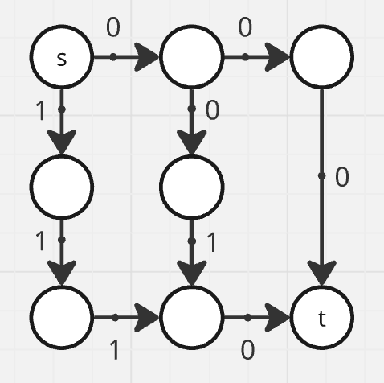
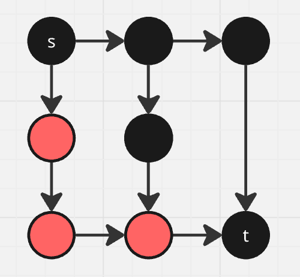

# Claim: Many is NP-hard

Proof. We will reduce from Longest Path of a weighted graph with non-negative integer weights, which is known to be NP-hard.

Let G be an instance of Longest Path problem. Enumerate the vertex set of G as V = {v_1, ..., v_n}. Enumerate the edge set of G as E = {e_1, ..., e_m}. For a directed graph, every edge is directed and points from u to v and has some edge weight w(e). A weighted undirected graph can be reduced to a directed weighted graph by turning any edge between u and v into two directed edges: One pointing from u to v and one pointing from v to u, both with the weight of the original edge.

Construct an instance G, V, E, R, B of Many as follows. Enumerate vertex set V(G) and edge set E(G) like before. Every vertex in V is colored black. For any edge e from u to v with w > 0, add w many red vertices in between u and v with edges connecting u to v through those red vertices. This is the et R(G). B(G) = V(G) - R(G).

For example, if G_example is an instance to Longest Path 

then the resulting instance to Many is 

(Note that the resulting instance is size O(|V|+|E|), which is polynomial in the size of G.)

Now let p ∈ P be a solution to Many for the instance. In other words the path p has the highest number of red vertices possible within a path from s to t. Then the corresponding path from s to t in Longest Path has maximum length in terms of edge weights.

Conversely, if p ∈ P is a solution to Longest Path with maximum length, then the corresponding path s to t in Many has the highest number of red vertices possible within a path from s to t.
